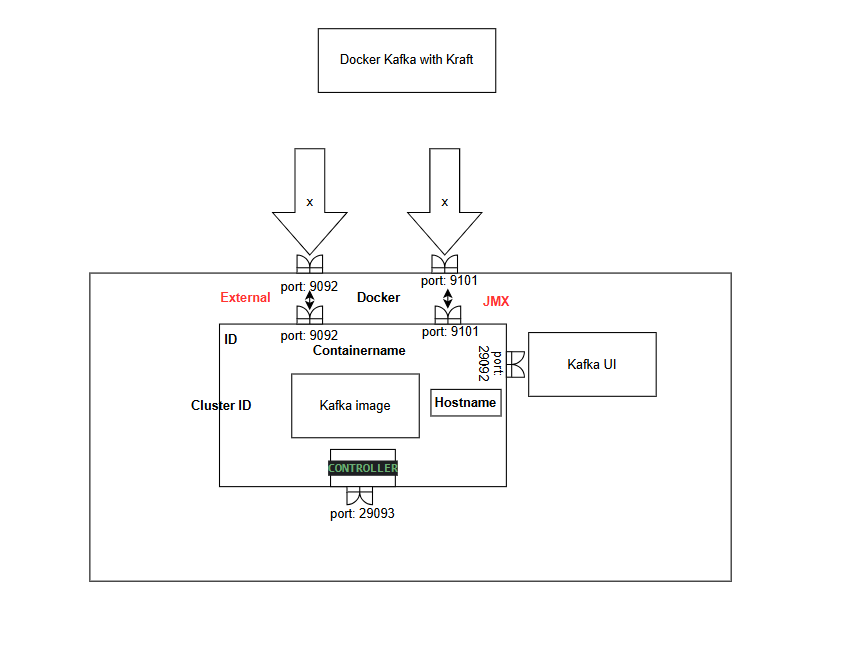
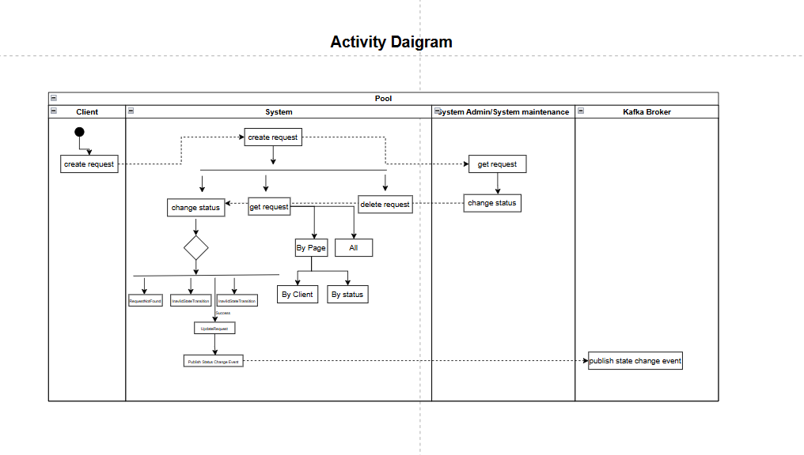
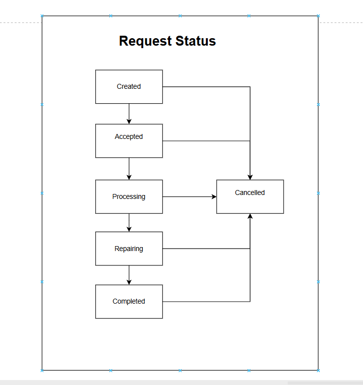
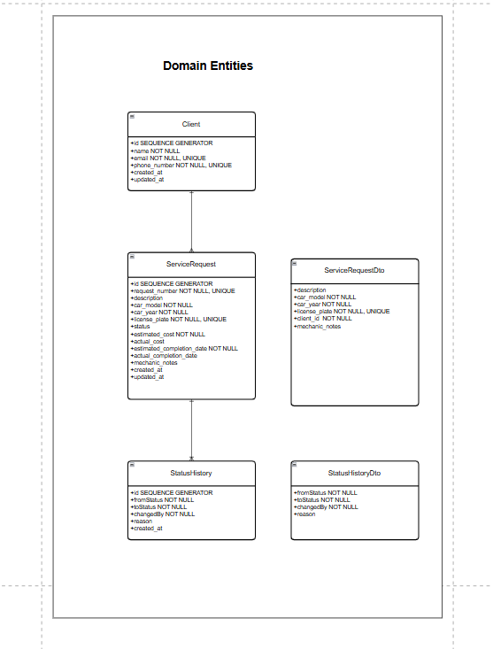
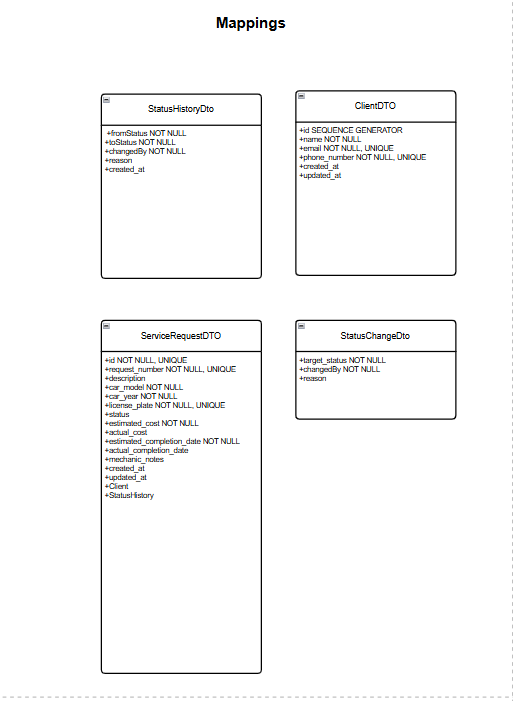

# Service Task Order (STO) Application

A Spring Boot application for managing service task orders in an automotive service center. This application allows creation and management of service requests, with status tracking and notification features.

## Features

- **Service Request Management**: Create, read, update, and delete service requests
- **Status Workflow**: Track service requests through their lifecycle (CREATED → ACCEPTED → IN_PROGRESS → REPAIR_IN_PROGRESS → COMPLETED)
- **Client Management**: Store client information and associate service requests with clients
- **Kafka Integration**: Send notifications through Kafka when service request status changes
- **PostgreSQL Database**: Persist data with automatic schema migrations using Flyway
- **Docker Support**: Run the entire application stack with Docker Compose
- **PgAdmin Support**: View tables and manage the PostgreSQL database using pgAdmin

## Tech Stack

- **Backend**: Spring Boot 3.5.0, Java 17
- **Database**: PostgreSQL, Flyway for migrations
- **Caching**: Redis
- **Mapping**: Mapstruct for object mapping
- **Messaging**: Kafka with Kraft for event-driven notifications
- **Infrastructure**: Docker, Docker Compose
- **Development Tools**: Maven

## Getting Started

### Prerequisites

- Docker and Docker Compose
- Java 17 (for local development)
- Maven (optional, wrapper included)

### Running with Docker Compose

Clone the repository and start the application stack:

```bash
git clone <repository-url>
cd STO
docker-compose up -d
```

This will start:
- PostgreSQL database (`port 5432`)
- Kafka broker (`port 9092`)
- Kafka UI dashboard (`port 8090`)
- pgAdmin for database management (`port 5050`)
- Spring Boot application (`port 8081`)
- PgAdmin (`port 5050`)

### Accessing the Application

- API: http://localhost:8081/api
- Kafka UI: http://localhost:8090
- pgAdmin: http://localhost:5050
  - Email: admin@admin.com
  - Password: admin
  - (Connect to the database **STO** with host: postgres, username: postgres, password: postgres)

## Architecture Diagrams

### Kafka Architecture with KRaft Mode



*Kafka is configured in KRaft mode (without Zookeeper) running in a Docker container with ports exposed for external (9092) and JMX (9101) access, and internal communication via port 29092*

### System Activity Diagram



*This diagram shows the request flow through the system, from creation to status changes and notification events*

### Request Status Workflow



*Service requests follow a defined workflow: Created → Accepted → In Progress → Repair In Progress → Completed, with a possible Cancelled state at any point*

## Data Model

### Domain Entities



*The core entities include Clients, ServiceRequests, and StatusHistory with their relationships*

### Object Mappings



*MapStruct is used to handle object mapping between entity and DTO layers*

## Database Structure

The application uses three main database tables:

1. **clients**: Stores client information (name, email, phone)
2. **service_requests**: Stores service requests with status and vehicle details
3. **status_history**: Tracks all status changes for service requests

The database schema is managed with Flyway migrations.

## Testing the Application

### Using Test HTTP Requests

A comprehensive set of test HTTP requests is available in `src/main/resources/test.http`.
This file can be used with:
- IntelliJ IDEA's HTTP Client
- VS Code's REST Client extension
- Any HTTP client that supports `.http` files

### Testing Notification and Kafka Features

1. **Connect to PgAdmin to view the table of service_requests - to get the info about status and further to change it to test the notification sending**
2. **Create a service request for notification testing**
   - Run the "Create new service request for notification testing" request in the test.http file

2. **Trigger notifications via status changes**
   - Run the status change requests in the test.http file
   - For example: "Status change with detailed notification information"

3. **Monitor notification logs**
   - Check the application logs to see emails and SMS notifications being sent
   - Docker logs: `docker logs sto-app`

4. **Verify Kafka messages**
   - Open the Kafka UI at http://localhost:8090
   - Navigate to the "Topics" section
   - Check the "status-change-events" topic to see the messages

## API Documentation

### Service Requests API

| Endpoint | Method | Description |
|----------|--------|-------------|
| `/api/v1/service-requests` | GET | Get all service requests |
| `/api/v1/service-requests/{id}` | GET | Get a service request by ID |
| `/api/v1/service-requests/number/{number}` | GET | Get a service request by number |
| `/api/v1/service-requests/client/{clientId}` | GET | Get service requests for a client |
| `/api/v1/service-requests/status/{status}` | GET | Get service requests by status |
| `/api/v1/service-requests` | POST | Create a new service request |
| `/api/v1/service-requests/{id}/status` | PUT | Change service request status |
| `/api/v1/service-requests/{id}` | DELETE | Delete a service request |


